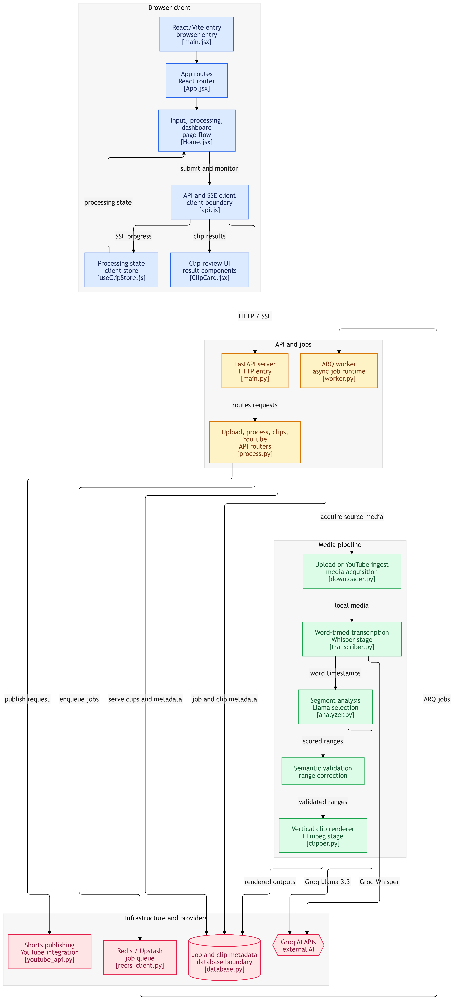

<p align="center"></p>

# AUVI — AI Video Clipper

> An AI-powered tool that automatically clips long-form videos into viral-ready shorts, complete with TikTok-style subtitles and a 9:16 vertical crop.

> [!WARNING]  
> **EXPERIMENTAL/UNTESTED:** The automatic YouTube Shorts Integration (Publishing) feature is currently in an **untested/unproven** state. It has not been thoroughly verified in production. Use with caution.

---

## Table of Contents

- [What is AUVI?](#what-is-auvi)
- [Key Features](#key-features)
- [System Architecture](#system-architecture)
- [Project Structure](#project-structure)
- [System Requirements](#system-requirements)
- [Quick Start Guide](#quick-start-guide)
- [Advanced Configuration](#advanced-configuration)
- [Troubleshooting](#troubleshooting)
- [Technologies Used](#technologies-used)
- [Contributing](#contributing)
- [License](#license)

---

## What is AUVI?

**AUVI (AI Video Clipper)** is a full-stack application that leverages artificial intelligence to automatically:

1. **Download** videos from YouTube (or accept direct uploads)
2. **Transcribe** audio to text with word-level timestamps
3. **Analyze** content and select the most engaging/viral segments
4. **Clip** the video into short vertical clips (9:16) complete with subtitles

| Part | Technology | Function |
|--------|-----------|--------|
| **Backend** | Python (FastAPI) | API Server — handles video downloads, transcription, AI analysis, and clipping |
| **Frontend** | React (Vite) | Web-based User Interface — upload, track progress, download results |

All AI processing uses the **Groq API** which is **100% FREE**.

---

## Key Features

**English:**
- Input from **YouTube URLs** or **direct video file uploads** (Dynamic HD Resolution fallback)
- Automatic transcription with **word-level timestamps** (Groq Whisper API)
- AI analyzes content and selects the most engaging segments (Llama 3.3 70B)
- Automatic **9:16 vertical crop** with face tracking and **HD Video Encoding**
- **10+ subtitle styles** — Manifesto, Bold Viral, Soft Edu, Corporate, Dark Mode, Market, Duo, Pop, Noir, Casefile
- **GPU-accelerated rendering** — AMD (AMF), NVIDIA (NVENC), Intel (QSV) with CPU fallback
- **Real-time** progress tracking via Server-Sent Events (SSE)
- Smart semantic validation (*Smart Trim*) to ensure clips have complete narrative arcs
- **100% Free** — entirely powered by the Groq API

**Bahasa Indonesia:**
- Input dari **YouTube URL** atau **upload file video** langsung (Resolusi HD Dinamis)
- Transkripsi otomatis dengan **word-level timestamps** (Groq Whisper API)
- AI menganalisis konten dan memilih segmen paling menarik (Llama 3.3 70B)
- **Crop vertikal 9:16** otomatis dengan face tracking dan **HD Video Encoding**
- **10+ gaya subtitle** — Manifesto, Bold Viral, Soft Edu, Corporate, Dark Mode, Market, Duo, Pop, Noir, Casefile
- **Rendering GPU-accelerated** — AMD (AMF), NVIDIA (NVENC), Intel (QSV) dengan fallback CPU
- Progress tracking **real-time** via Server-Sent Events (SSE)
- Validasi semantik pintar (*Smart Trim*) untuk memastikan klip memiliki narasi utuh
- **100% gratis** — menggunakan Groq API

---

## System Architecture

<p align="center">
  
</p>

AUVI is built using a modern modular architecture based on an *internal micro-pipeline* that decouples I/O intensive workloads (video downloads & API transmissions) from pure computational workloads (FFmpeg media processing & AI parsing).

### 1. Browser Client Layer

The React/Vite frontend handles user interaction through three main pages — **Home** (input portal), **Processing** (real-time SSE progress terminal), and **Dashboard** (clip results & publishing). State is managed centrally via Zustand (`useClipStore.js`) and all API communication flows through the `api.js` boundary layer.

### 2. API & Jobs Layer

- **FastAPI Application Server (`main.py`):** Receives HTTP requests and routes them through dedicated API routers (`process.py`, `clips.py`, `upload.py`).
- **ARQ Asynchronous Worker (`worker.py`):** Video analysis requests are not processed on the main HTTP thread. Jobs are queued in **Upstash Redis (SSL)** and executed by the ARQ Worker in the background with job timeouts up to **1 hour** and exponential backoff retry mechanisms.
- **Real-Time SSE Tracking:** The server broadcasts millisecond status updates via *Server-Sent Events (SSE)* so users can track the pipeline *(Downloading → Transcribing → Analyzing → Clipping → Ready)* transparently.

### 3. Media Pipeline

The core processing chain runs inside the ARQ Worker:

| Stage | Module | Description |
|-------|--------|-------------|
| **Ingest** | `downloader.py` | Extracts video/audio from YouTube (yt-dlp) or accepts direct uploads |
| **Transcribe** | `transcriber.py` | Produces word-timed transcription via Groq Whisper Large-v3 |
| **Analyze** | `analyzer.py` | Senior Video Editor prompting (Llama 3.3 70B) with sentence-aware smart chunking |
| **Validate** | `semantic_validator.py` | Bilingual linguistic engine — snaps timestamps to word boundaries, completes lists & questions, eliminates dangling connectors |
| **Render** | `clipper.py` | FFmpeg vertical crop, subtitle burning with 10+ style templates, GPU-accelerated encoding |

### 4. AI & NLP Intelligence

- **Senior Video Editor Prompting (Llama 3.3 70B):** The LLM acts as the sole decision-maker, hunting for *viral hooks* and parsing content into highly marketable subtopics (30–180s) graded with a virality score from 1 to 100.
- **Sentence-Aware Smart Chunking:** Transcripts are divided into balanced 10-minute blocks (600s) that never cut mid-sentence. A 35+ minute video only requires ~4 network calls (~4,000 tokens), making it highly efficient.
- **Pure-AI Quality Guarantee:** If the API disconnects or tokens are depleted, the system refuses to generate "dummy" clips — it surfaces an error to maintain content integrity.

### 5. Infrastructure & Providers

| Service | Module | Purpose |
|---------|--------|---------|
| **Groq AI APIs** | External | Whisper transcription & Llama 3.3 analysis |
| **Redis / Upstash** | `redis_client.py` | High-speed job queue with SSL |
| **Database** | `database.py` | PostgreSQL (Supabase) or SQLite fallback for job & clip metadata |
| **YouTube Shorts** | `youtube_api.py` | Google OAuth 2.0 integration for one-click publishing |

---

## Project Structure

```
AUVI/
├── README.md                   <- This file
├── AUVI_diagram.png            <- System architecture diagram
├── LICENSE                     <- MIT License
├── CODE_OF_CONDUCT.md          <- Community guidelines
├── CONTRIBUTING.md             <- Contribution guide
├── package.json                <- Shortcut scripts (npm run dev, etc.)
│
└── ai-clipper/                 <- Main application folder
    ├── .env                    <- Secrets & API Key Configuration
    ├── dev.py                  <- Integrated script launching backend + frontend
    ├── docker-compose.yml      <- Docker Container Orchestrator & Networking
    ├── storage/                <- Isolated storage for original media & clips
    │
    ├── backend/                <- Backend Server (Python/FastAPI)
    │   ├── Dockerfile          <- Backend Service Containerization Instructions
    │   ├── main.py             <- Entry point — FastAPI Middleware & CORS init
    │   ├── database.py         <- PostgreSQL ORM connector (Supabase / SQLite fallback)
    │   ├── worker.py           <- ARQ Asynchronous Worker & Queue Pipeline
    │   ├── redis_client.py     <- Connection Manager & Upstash Redis Resiliency
    │   ├── requirements.txt    <- Python Library Dependencies
    │   ├── fonts/              <- Bundled subtitle fonts (Georgia, Anton, Oswald, etc.)
    │   ├── models/
    │   │   ├── __init__.py
    │   │   └── schemas.py      <- Pydantic & SQLAlchemy ORM Models
    │   ├── routers/
    │   │   ├── __init__.py
    │   │   ├── process.py      <- Job Pipeline Process API Router
    │   │   ├── upload.py       <- Direct Media Upload API Router
    │   │   └── clips.py        <- Extraction, Streaming, & Shorts Automation API
    │   └── services/
    │       ├── __init__.py
    │       ├── downloader.py       <- High-Res Video/Audio Extractor (yt-dlp)
    │       ├── transcriber.py      <- High-Precision Transcriber (Groq Whisper API)
    │       ├── analyzer.py         <- Senior AI Editor & Smart Chunking (Llama 3.3 70B)
    │       ├── clipper.py          <- FFmpeg Commander, 9:16 Crop & Subtitle Burning
    │       ├── clip_validator.py   <- Physical File Format & Characteristics Validator
    │       ├── semantic_validator.py <- Linguistic Engine (Bilingual Narrative Check)
    │       └── youtube_api.py      <- Google OAuth 2.0 Controller & Publishing
    │
    └── frontend/               <- User Interface (React/Vite)
        ├── Dockerfile          <- Web Frontend Containerization Instructions
        ├── package.json        <- Node.js Ecosystem & Dependencies
        ├── vite.config.js      <- Dev Server & Proxy Middleware Configuration
        ├── tailwind.config.js  <- Custom TailwindCSS Theme & Design Tokens
        ├── index.html          <- Main HTML Frame
        └── src/
            ├── main.jsx        <- React Init & Virtual DOM Renderer
            ├── App.jsx         <- Navigation Contractor & Client-Side Routing
            ├── index.css       <- Global Styling & Design Tokens
            ├── pages/
            │   ├── Home.jsx        <- Landing Page & Media Input Portal
            │   ├── Processing.jsx  <- Live-Stream Progress Terminal (SSE)
            │   └── Dashboard.jsx   <- Clip Results Showcase & Publishing
            ├── components/
            │   ├── UploadZone.jsx       <- Dynamic File Upload Drop-Zone
            │   ├── YouTubeInput.jsx     <- YouTube Web URL Extractor & Validator
            │   ├── ProcessingSteps.jsx  <- Animated Visual AI Stage Indicators
            │   ├── ClipCard.jsx         <- Clip Showcase Card, Virality Score, & YT Options
            │   ├── ClipPreviewModal.jsx <- Full-Screen Result Video Player Modal
            │   ├── ClipTimeline.jsx     <- Visual Timeline Navigator
            │   ├── VideoPlayer.jsx      <- Modern Vertical Media Player
            │   ├── CaptionOverlay.jsx   <- Live TikTok Subtitle Animation Simulator
            │   ├── GenerateOptionsModal.jsx <- Clip Settings & Subtitle Style Picker
            │   └── SettingsDrawer.jsx   <- Language & Viral Score Threshold Controls
            ├── store/
            │   └── useClipStore.js  <- Global State Management (Zustand Architecture)
            └── lib/
                └── api.js           <- Async API Engine & Interceptors
```

---

## System Requirements

Before you begin, ensure your machine meets the following requirements:

| Component | Minimum | Recommended |
|----------|---------|------------------|
| **OS** | Windows 10, macOS 10.15, Ubuntu 20.04 | Windows 11, macOS 14+, Ubuntu 22.04 |
| **RAM** | 4 GB | 8 GB or more |
| **Storage** | 5 GB free space | 10 GB+ (for large videos) |
| **GPU** | None (CPU fallback) | AMD Radeon / NVIDIA GTX 1060+ / Intel QSV |
| **Dependencies**| Git, Python 3.11+, Node.js 20+, FFmpeg | Same |

---

## Quick Start Guide

You can easily get the application running on your local machine by following these quick steps.

### 1. Clone the Repository

```bash
git clone https://github.com/Alistaire-Q/AUVI.git
cd AUVI
```

### 2. Configure API Keys

AUVI uses the Groq API for transcription and content analysis. 
Get your free API key at [https://console.groq.com](https://console.groq.com).

Create a `.env` file in the `ai-clipper/` directory:

```env
# AUVI Configuration
GROQ_API_KEY=gsk_PASTE_YOUR_API_KEY_HERE
LLM_API_KEY=gsk_PASTE_YOUR_API_KEY_HERE
```

### 3. Install Dependencies

**For the Backend (Python):**
```bash
cd ai-clipper/backend
pip install -r requirements.txt
cd ../..
```

**For the Frontend (Node.js):**
```bash
cd ai-clipper/frontend
npm install
cd ../..
```

### 4. Run the Application

From the root directory of the project, run the integrated development script:

```bash
python ai-clipper/dev.py
```

This script will start both the backend (port 8000) and frontend (port 5173). 
Open your browser and navigate to: `http://localhost:5173`

*(Note: If you prefer Docker, you can simply run `docker compose up --build -d` inside the `ai-clipper` folder).*

---

## Advanced Configuration

If you are using Supabase, Google OAuth, or Upstash Redis for background workers, you can use the following full template for your `.env` file:

```env
# AUVI Configuration
GROQ_API_KEY=gsk_PASTE_YOUR_API_KEY_HERE
LLM_API_KEY=gsk_PASTE_YOUR_API_KEY_HERE

# LLM Configuration (optional)
# LLM_BASE_URL=https://api.groq.com/openai/v1
# LLM_MODEL=llama-3.3-70b-versatile
# STORAGE_PATH=./storage

# Supabase (PostgreSQL) Database URL
DATABASE_URL=your_postgresql_database_url_here

# Google OAuth 2.0 Credentials (for YouTube)
GOOGLE_CLIENT_ID=your_google_client_id_here
GOOGLE_CLIENT_SECRET=your_google_client_secret_here
GOOGLE_REDIRECT_URI=http://localhost:8000/api/youtube/callback

# Redis Configuration (Required for ARQ Background Worker)
REDIS_HOST=your_redis_host_here
REDIS_PORT=6379
REDIS_PASSWORD=your_redis_password_here
REDIS_SSL=true
```

---

## Troubleshooting

| Issue | Solution |
|-------|----------|
| `ffmpeg: command not found` | Ensure FFmpeg is installed and added to your system PATH |
| `Request failed with status code 500` | Check the backend logs for details on what caused the failure |
| `Download failed: ERROR: Requested format is not available` | Update yt-dlp: `pip install --upgrade yt-dlp` |
| GPU rendering falls back to CPU | Ensure your GPU drivers are up to date. AMD needs AMF SDK, NVIDIA needs CUDA toolkit |
| `disk I/O error` on SQLite | Close other apps using heavy disk I/O during processing |

---

## Technologies Used

| Technology | Category | Description |
|-----------|----------|------------|
| **Python 3.11** | Language | Backend programming language |
| **FastAPI** | Backend Framework | Modern, fast web framework for Python with auto-generated API docs |
| **yt-dlp** | Tool | Downloads videos from YouTube and other platforms |
| **FFmpeg** | Tool | The swiss army knife for video/audio processing |
| **Groq Whisper API** | AI Service | Transcribes audio into text with timestamps |
| **Llama 3.3 70B** | AI Model | Large Language Model for content analysis & hook detection |
| **React 18** | Frontend Framework | UI library for building interactive interfaces |
| **Vite** | Build Tool | Extremely fast development server & bundler |
| **TailwindCSS** | CSS Framework | Utility-first CSS styling framework |
| **Zustand** | State Management | Lightweight global state for React |
| **ARQ** | Task Queue | Async job processing with Redis backend |
| **Docker** | Containerization | Runs the application in isolated environments |

---

## Contributing

We are open to contributions. Here's how you can contribute:

1. Fork this repository
2. Clone your fork (`git clone https://github.com/YOUR_USERNAME/AUVI.git`)
3. Create a new branch (`git checkout -b new-feature`)
4. Make your changes and commit (`git commit -m "Add new feature X"`)
5. Push to the branch (`git push origin new-feature`)
6. Open a Pull Request on GitHub

---

## License

This project is licensed under the **MIT License** — see the [LICENSE](LICENSE) file for details.

```
MIT License
Copyright (c) 2026 Olly
```

<div align="center">
Happy Clipping! 🎬
</div>
